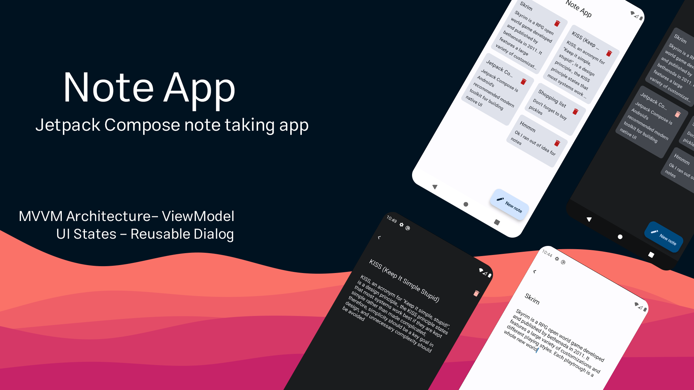

# Jetpack Compose MVVM Note Taking APP

A note taking app for android using Jetpack Compose. It features structured architecture, separation
of UI, business logic and data layer, and totally stateful.

## Features

This app is written in Kotlin language. So its easy to maintain and adding features. It also uses 
room database, hilt dependency injection and compose destinations libraries. Code is commented and 
It's easy to use.

## ScreenShots

## About me
Note app developed by [Ali Bardide]("GitHub.com/alibardide5124"). You can find me on 
[LinkedIn]("linkedin.com/in/alibardide5124/") or [Instagram]("instagram.com/alibardide.5124")