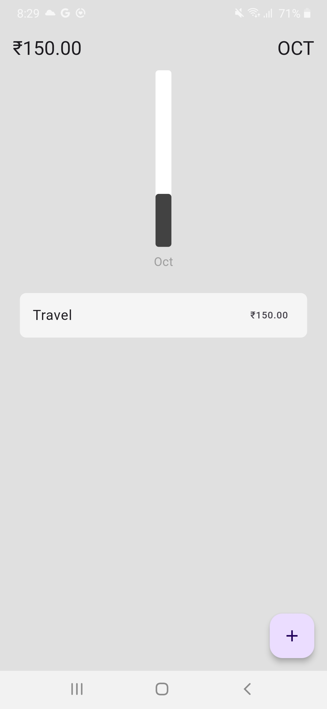
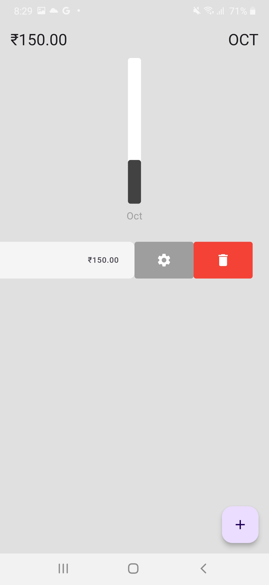

# Expense Tracker App

An intuitive Expense Tracker application built using Flutter, designed to help users manage their daily expenses efficiently. This app features a beautiful user interface, smooth animations, and a simple way to track income and expenses.

## Features

- Add, update, and delete expense or income entries.
- View expenses in a categorized and date-wise manner.
- Graphical representation of spending habits using pie and bar charts.
- Swipe to delete or edit entries.
- Persistent storage using the Isar NoSQL database.
- Multi-platform support: Android and iOS.

## Getting Started

### Prerequisites

- Flutter SDK: Make sure you have Flutter installed. You can download it [here](https://flutter.dev/docs/get-started/install).
- Dart SDK: Comes pre-installed with Flutter.

### Packages Used

This app uses the following Flutter packages:

- [`cupertino_icons`](https://pub.dev/packages/cupertino_icons): ^1.0.8  
  For Cupertino design icons in the app.
  
- [`isar`](https://pub.dev/packages/isar): ^3.1.0+1  
  A fast and efficient NoSQL database for data storage.
  
- [`isar_flutter_libs`](https://pub.dev/packages/isar_flutter_libs): ^3.1.0+1  
  Required Isar plugins for Flutter.

- [`path_provider`](https://pub.dev/packages/path_provider): ^2.1.4  
  Provides access to the file system to store and access Isar database files.

- [`provider`](https://pub.dev/packages/provider): ^6.1.2  
  State management solution for handling the app's state.

- [`intl`](https://pub.dev/packages/intl): ^0.19.0  
  To format dates, numbers, and currencies according to internationalization standards.

- [`flutter_slidable`](https://pub.dev/packages/flutter_slidable): ^3.1.1  
  Allows for sliding actions like edit and delete on expense items.

- [`fl_chart`](https://pub.dev/packages/fl_chart): ^0.69.0  
  To create beautiful and customizable charts for visualizing expense data.

### Installation

1. Clone the repository:

```bash
git clone https://github.com/iPriyanshu19/CodeClauseInternship_Expense-tracker.git
```

2. Navigate to the project directory:

```bash
cd CodeClauseInternship_Expense-tracker
```

3. Install dependencies:

```bash
flutter pub get
```

4. Run the app:

```bash
flutter run
```

### Directory Structure

```bash
lib/
│
├── main.dart                   # Entry point of the app
├── models/                     # Contains the data models
├── pages/                      # Contains the HomePage
├── components/                 # Different screens (Home, Add Expense, etc.)
├── helper/                     # Helper Functions
├── bar graph/                  # Bar Graph components
└── database/                   # Database and utility services (e.g., Isar service)
```

## Usage

1. Add new expense or income entries by tapping the '+' button.
2. Swipe left or right on an entry to delete or edit it.
3. View graphical charts for a visual representation of your expenses and income.
4. Track expenses by categories and time periods (e.g., daily, weekly).

## Screenshots




## Contributing

Contributions are welcome! If you find any issues or have suggestions for improvements, feel free to open an issue or submit a pull request.

1. Fork the repository.
2. Create a new branch (`git checkout -b feature/your-feature-name`).
3. Make your changes and commit (`git commit -m 'Add some feature'`).
4. Push to the branch (`git push origin feature/your-feature-name`).
5. Open a Pull Request.
